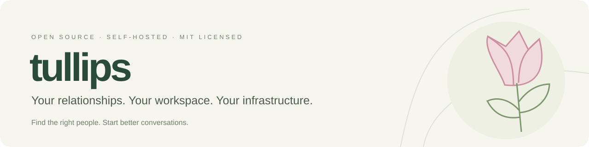
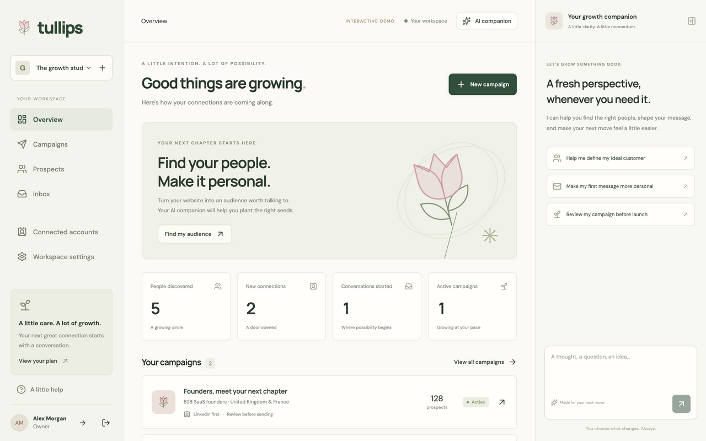

<p align="center">
  
</p>

<p align="center">
  <a href="https://github.com/jcardonne/tullips/actions/workflows/checks.yml"></a>
  <a href="LICENSE"></a>
  <a href="https://github.com/jcardonne/tullips/releases"></a>
</p>

<p align="center">
  <a href="#get-started">Get started</a> ·
  <a href="docs/updates.md">Updates & recovery</a> ·
  <a href="docs/usage.md">Configuration</a> ·
  <a href="docs/integrations.md">Integration coverage</a>
</p>

**Tullips is a self-hostable, LinkedIn-first prospecting workspace.** Understand your product, find your audience, organize prospects, and prepare thoughtful outreach with an AI companion. Your database, your model provider, your infrastructure.



## A workspace for meaningful outreach

| Find your people | Start the conversation | Stay in control |
| --- | --- | --- |
| Turn a website into an audience brief | Build versioned campaign sequences | Review and approve outreach |
| Organize prospects, tags, notes, and CSV imports | Keep conversations in a unified inbox | Choose your own AI gateway |
| Qualify and review prospects with AI | Work across LinkedIn and email | Host it yourself under the MIT license |

An MCP endpoint and scoped API keys let your agents work alongside you. The interactive demo uses synthetic records and never sends messages.

## Get started

You need **Docker with Compose** and **Python 3.12+**.

```sh
git clone https://github.com/jcardonne/tullips.git
cd tullips
python3 scripts/setup.py
docker compose up -d --build
```

Open **[localhost:3000](http://localhost:3000)** and create your account. The first registered user becomes the installation administrator. Create that account before exposing a fresh installation publicly.

Setup generates local secrets, configures persistent PostgreSQL storage, and includes the updater. Automatic updates are **off by default**. API and database ports stay private, and the web service binds to localhost. For public access, add an HTTPS reverse proxy and set `APP_URL` in `.env`.

> Keep `.env` and its encryption key backed up. The key is required to read saved account credentials.

### Bring your model

Set these values in `.env` for an OpenAI-compatible provider or gateway:

```dotenv
LLM_BASE_URL=https://your-gateway.example/v1
LLM_API_KEY=your-provider-key
LLM_MODEL=your-model
```

The optional LiteLLM service is available through `docker compose --profile ai up -d --build`. See [AI gateway configuration](docs/usage.md#ai-gateway).

## Updates that respect your data

Installation administrators can use **Workspace settings → Installation updates** or the server CLI to check releases, install updates, and enable unattended patch/minor updates. Major upgrades always require approval.

Every update downloads and verifies the release, stops application writes, creates a local backup, runs migrations, and checks service health before reopening the application. Failed backups block installation. Safe rollbacks happen automatically. Database restoration requires explicit approval.

| Deployment | Update integration |
| --- | --- |
| Docker Compose | Pinned images and coordinated service replacement |
| Coolify | Deployment API with immutable image digests |
| Kubernetes | Migration jobs, deployment updates, and readiness checks |
| Linux + systemd | Verified source archives and separate release directories |

The [operator guide](docs/updates.md) covers installation layouts, permissions, backups, recovery commands, and validation limits. Local source changes block automatic updates so your work is preserved.

**Already running Tullips?** Back up your installation, then follow the [existing-installation migration](docs/updates.md#existing-installations). Existing users receive administrator access through an explicit CLI assignment.

## Integrations and current scope

Real outbound delivery is disabled by default with `LIVE_SENDS=false`. Configure and validate providers before enabling it. LinkedIn's private protocols can change, and some flows still require real-account verification. Read the [integration coverage](docs/integrations.md) and [validation notes](docs/VALIDATION.md) before running campaigns.

The hosted edition uses the same application with workspace subscriptions and AI credits. Self-hosted installations use `DEPLOYMENT_MODE=selfhosted`.

## Development

```sh
# Backend
cd backend
go test ./...
go vet ./...

# Frontend
cd ../web
npm ci
npm run build
npm run typecheck
npm test

# Updater regression checks
cd ..
python3 -m unittest discover -s updater -p 'test_*.py' -v
```

See [native development](docs/usage.md#development-and-checks), [the product specification](docs/SPEC.md), and [release operations](docs/updates.md#publishing-a-release). Contributions should include a focused change and a reproducible check.

---

<p align="center">Built for thoughtful outreach. Yours to run, study, and improve.</p>
